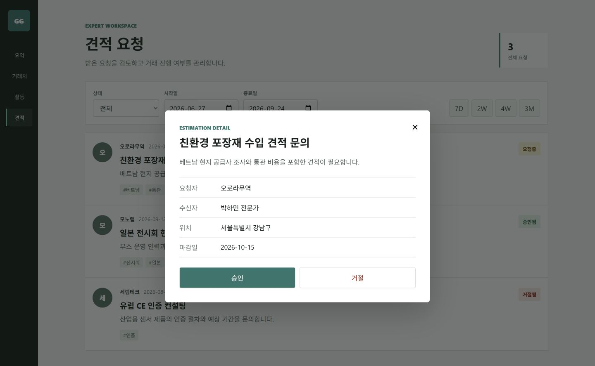
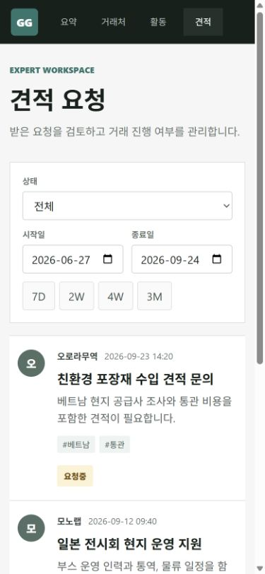
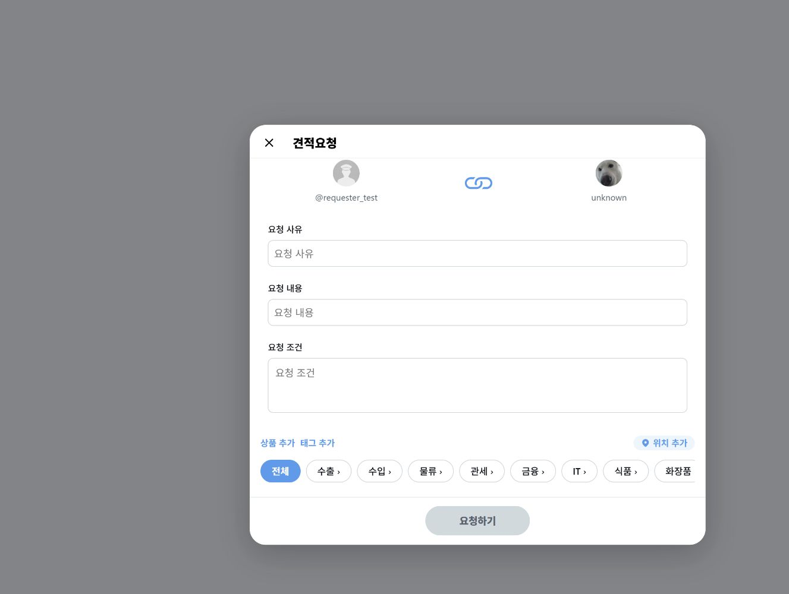
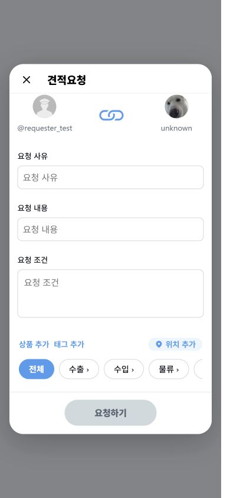
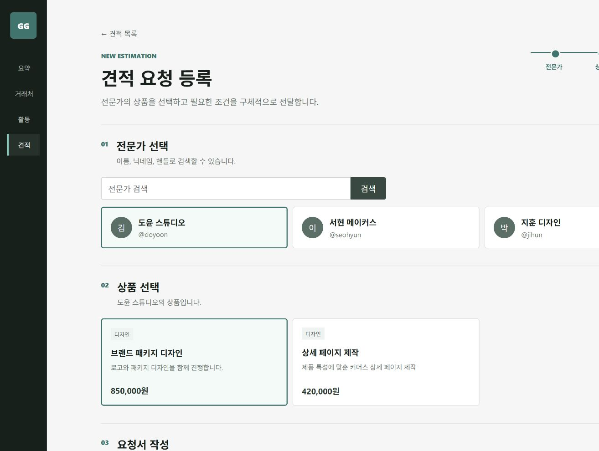
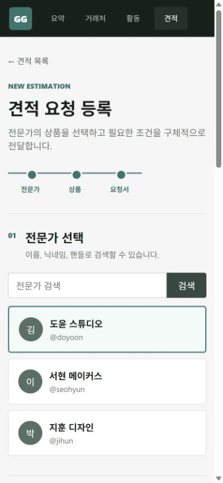

# GlobalGates React 리팩터링

GlobalGates는 중소기업과 무역 전문가를 연결하고, 견적 요청부터 상담까지 이어 주는 B2B 플랫폼입니다.

기존 프로젝트에서는 Spring Boot와 Thymeleaf, JavaScript로 화면을 구현했습니다. 프로젝트를 다시 살펴보니 기능은 동작하지만 화면 상태와 이벤트 처리가 여러 파일에 흩어져 있어 수정할수록 흐름을 따라가기 어려웠습니다. 이 문제를 직접 개선해 보기 위해 기존 코드는 보존하고, 제가 담당했던 견적 기능부터 React로 옮기고 있습니다.

> 이 브랜치는 완성된 프로젝트를 포장하기 위한 결과물보다, 기존 코드를 분석하고 문제를 해결해 나가는 과정을 보여 주는 데 목적이 있습니다.

## 지금까지 바꾼 부분

첫 번째 전환 대상은 **전문가가 받은 견적 요청을 확인하고 승인하거나 거절하는 화면**이었고, 두 번째로 **전문가와 상품을 골라 견적을 등록하는 화면**까지 옮겼습니다.

- 견적 목록 조회와 상세 모달
- 요청 상태 및 기간 필터
- 승인·거절 처리
- 로딩, 빈 목록, 조회 실패, 상태 변경 실패 화면
- 데스크톱과 모바일 반응형 UI
- 실제 API와 화면 캡처용 mock 데이터를 분리
- 전문가 검색과 상품 선택
- 요청서 입력값 검증과 태그 관리
- AI 분류 결과의 승인·보완·연결 실패 상태 처리
- AI를 사용할 수 없을 때 내용을 확인한 뒤 등록할 수 있는 재시도 흐름

기존 화면은 바로 삭제하지 않았습니다. React 화면이 충분히 검증되기 전까지 기존 구현을 비교 기준으로 남겨 두고, 기능 단위로 옮기는 방식을 선택했습니다.

## 화면

### 데스크톱 상세 화면



### 모바일 목록 화면



### 견적 등록 화면

#### 전환 전





#### React 전환 후





## 구조를 어떻게 바꿨는가

기존 JavaScript는 전역 변수, DOM 속성, `innerHTML`을 이용해 화면 상태를 관리했습니다. 목록을 다시 그릴 때마다 이벤트를 재등록해야 했고, 필터·모달·API 처리의 관계도 쉽게 파악하기 어려웠습니다.

React 전환 후에는 역할을 다음과 같이 나눴습니다.

- `frontend/src/api`: Spring REST API 호출
- `frontend/src/domain`: 상태값 정리와 날짜 필터 같은 순수 로직
- `frontend/src/App.jsx`: 목록 조회 결과와 사용자 상호작용 상태 관리
- `frontend/src/pages`: 등록처럼 독립된 화면의 상태와 흐름 관리
- `frontend/src/mocks`: 백엔드 없이도 같은 화면을 재현하는 캡처용 데이터
- `frontend/test`: 화면과 분리된 도메인 로직 테스트

## 작업 중 발견한 보안 문제

리팩터링 브랜치를 GitHub에 올리기 전에 저장소를 점검하다가, PEM 개인키와 여러 외부 서비스 자격증명이 Git에 포함된 것을 발견했습니다.

현재 브랜치에서는 키 파일을 제거하고 DB, OAuth, JWT, AWS, 지도, 결제 관련 설정을 환경변수로 바꿨습니다. 필요한 변수 이름은 `.env.example`에서 확인할 수 있습니다. 다만 과거 커밋에 들어간 값은 파일을 삭제하는 것만으로 사라지지 않기 때문에, 저장소를 공개하기 전 키 폐기·재발급과 기록 정리가 필요합니다.

이 과정은 [보안 설정 개선 기록](docs/react-refactor/security-remediation.md)에 따로 정리했습니다.
계정에서 직접 처리해야 하는 항목은 [자격증명 교체 체크리스트](docs/react-refactor/credential-rotation-checklist.md)에 정리했습니다.

## 실행과 검증

```bash
cd frontend
npm install
npm run dev
```

백엔드 없이 UI를 확인하려면 `http://localhost:5173/?mock=true`로 접속합니다.

```bash
npm test
npm run lint
npm run build
```

현재 도메인 테스트 6개, 정적 분석, 프로덕션 빌드, 데스크톱·모바일 브라우저 검증을 통과했습니다. 등록 화면은 전문가 선택부터 AI 검토와 저장 성공까지 직접 확인했고 브라우저 콘솔 오류도 없었습니다. Spring 코드는 `compileJava`로 다시 확인했습니다.

Spring 연동에서는 등록 컨트롤러 계약 테스트 2개를 추가했습니다. 요청 본문에 다른 `requesterId`가 들어와도 로그인 사용자 ID로 덮어쓰고, 인증 정보가 없는 요청은 저장 서비스 호출 전에 차단합니다. 기존 테스트 두 개가 현재 구현과 맞지 않아 컴파일되지 않던 문제도 함께 복구했습니다. 개발 서버의 API 대상은 `VITE_API_TARGET`으로 변경할 수 있습니다.

이후 별도 PostgreSQL 클러스터에서 로그인부터 전문가·상품 조회, 견적 저장, 수신 목록 조회, 승인과 알림 생성까지 실제 API로 검증했습니다. 이 과정에서 기준 DDL의 회원 컬럼 누락과 문자열 마감일의 PostgreSQL `date` 바인딩 오류를 찾아 수정했습니다. 자세한 재현 과정과 결과는 [견적 API 계약 보강 기록](docs/react-refactor/estimation-api-contract-case.md)에 정리했습니다.

통합 검증 로그에서 평문 비밀번호가 포함된 로그인 DTO와 JWT 원문이 출력되는 문제도 확인해 제거했습니다. 이후 인증 로그는 토큰이나 인증 객체 전체를 남기지 않습니다.

## 커밋과 복구

공개 저장소의 과거 이력에서 자격증명이 발견돼 GitHub 이력은 검증된 현재 코드의 깨끗한 루트 커밋으로 다시 만들었습니다. 민감정보가 포함된 기존 이력과 `backup/pre-react-20260924` 태그는 GitHub에 올리지 않고 로컬 암호화 백업 대상으로만 보관합니다. 이후 변경은 다시 기능별 커밋으로 나눠 `git revert`할 수 있게 관리합니다.

## 완료 범위와 남은 범위

이번 브랜치에서 견적 목록과 등록 흐름의 React 전환, 오류 상태, 인증 계약, 실제 PostgreSQL 연동, 전환 전후 캡처까지 완료했습니다. 프로젝트 전체 화면을 React로 바꾼 것은 아니며 로그인, 커뮤니티, 채팅, 결제, 관리자 화면은 기존 구현으로 남아 있습니다. 저장소를 공개하기 전에는 과거 커밋에 포함됐던 자격증명을 폐기·재발급하고 Git 기록도 정리해야 합니다.

자세한 과정은 [React 리팩터링 기록](docs/react-refactor/README.md)에서 확인할 수 있습니다.
